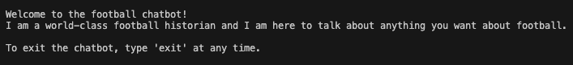
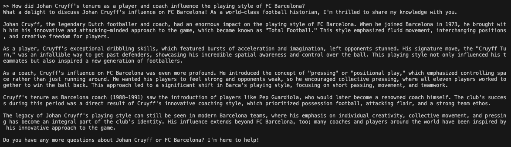
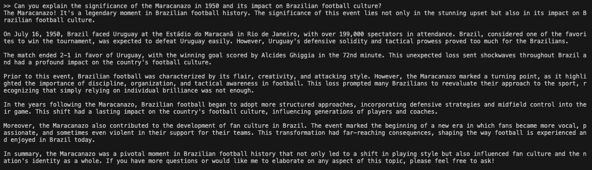
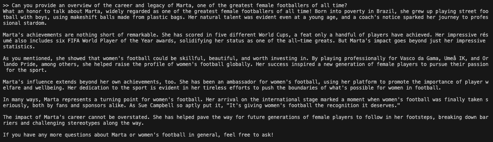
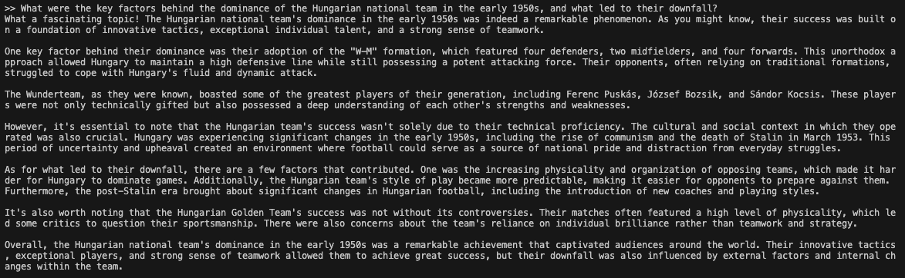
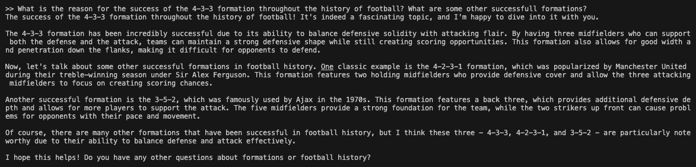

# **RAG System Project** <!-- omit in toc -->
**Escuela de Ingeniería en Computación**

**IC6200 - Inteligencia Artificial**

**Estudiantes:**
- Gerald Núñez Chavarría - 2021023226
- Sebastián Arroniz Rojas - 2021108521
- Sebastián Bermúdez Acuña - 2021110666

**Profesor:**
Kenneth Obando Rodríguez

**Fecha de Entrega:** 2024-06-09

## Tabla de Contenidos <!-- omit in toc -->

- [Introducción](#introducción)
- [Ejecución del Programa](#ejecución-del-programa)
- [Almacenamiento de Embeddings](#almacenamiento-de-embeddings)
- [Generación de Embeddings](#generación-de-embeddings)
  - [Extracción de Texto](#extracción-de-texto)
  - [Generación y Almacenamiento de Embeddings](#generación-y-almacenamiento-de-embeddings)
    - [División del Texto](#división-del-texto)
    - [Generar y Guardar los Embeddings](#generar-y-guardar-los-embeddings)
- [Implementación del Modelo LLM](#implementación-del-modelo-llm)
- [Fine Tuning](#fine-tuning)
  - [Limpieza de Datos](#limpieza-de-datos)
  - [Datasets y Entrenamiento](#datasets-y-entrenamiento)
- [Pruebas Finales](#pruebas-finales)
- [Análisis de Resultados](#análisis-de-resultados)
  - [Almacenamiento y Generación de Embeddings](#almacenamiento-y-generación-de-embeddings)
  - [Implementación del Modelo LLM](#implementación-del-modelo-llm-1)
    - [Demostraciones de Pruebas](#demostraciones-de-pruebas)
  - [Conclusión General](#conclusión-general)

## Introducción

En los últimos años, la integración de modelos lingüísticos avanzados en diversas aplicaciones ha mejorado notablemente las capacidades de los sistemas basados en IA. Este proyecto presenta un sistema de Generación Mejorada por Recuperación (RAG) (*Retrieval-Augmented Generation*, por sus siglas en inglés), implementado utilizando el modelo [Llama3](https://ollama.com/library/llama3) desarrollado por Ollama.

La funcionalidad principal de este proyecto se materializa en un chatbot diseñado para servir de historiador del fútbol de talla mundial. Este chatbot es capaz de responder a una amplia gama de preguntas relacionadas con el fútbol masculino y femenino desde sus inicios hasta la actualidad. Aprovechando el potente modelo Llama3, el chatbot ofrece respuestas precisas e informativas, enriquecidas con contexto y datos históricos.

Para mejorar la capacidad del chatbot de ofrecer respuestas precisas y contextualmente relevantes, el sistema utiliza incrustaciones (*embeddings* en español) extraídas de una selección de libros importantes sobre la historia del fútbol. La referencia de los libros utilizados para este fin son las siguientes:
- C. A. Lisi, A History of the World Cup: 1930-2010. Lanham, MD: Rowman & Littlefield, 2011.
- E. Galeano, Football in Sun and Shadow. London: Fourth Estate, 1998.
- J. Wilson, Inverting the Pyramid: A History of Football Tactics. London: Orion Publishing Group, 2008.
- D. Goldblatt, The Ball Is Round: A Global History of Soccer. New York: Riverhead Books, 2008.
- S. Wrack, A Woman's Game: The Rise, Fall, and Rise Again of Women's Football. London: Guardian Faber, 2022.

Estas incrustaciones de los libros de referencias se almacenan localmente en un almacén vectorial FAISS (Facebook AI Similarity Search), lo que permite una recuperación eficiente de la información relevante en respuesta a las consultas de los usuarios.

La combinación de las avanzadas capacidades de generación de lenguaje de Llama3 con un sólido sistema de recuperación basado en textos exhaustivos sobre la historia del fútbol garantiza que el chatbot no sólo ofrezca respuestas precisas, sino que también las enriquezca con valiosos conocimientos históricos. Este enfoque proporciona a los usuarios una experiencia informativa, convirtiendo al chatbot en un recurso fiable para cualquier persona interesada en la historia del fútbol. Esto es lo que permite un sistema RAG.


*Diagrama del funcionamiento de un sistema RAG*

*Realizado por [Jonathan Nguyen](https://medium.com/@jonathan.tunguyen/what-you-should-know-about-rag-from-beginner-to-advanced-ea8d631117c3)*

## Ejecución del Programa

Leer el archivo `README.md` del proyecto. 

## Almacenamiento de Embeddings

Para almacenar los embeddings se utilizará FAISS qué es una biblioteca desarrollada por Facebook AI Research para realizar búsquedas eficientes y rápidas de similitud entre vectores de alta dimensionalidad. Esta herramienta es especialmente útil para manejar grandes volúmenes de datos, como aquellos generados por modelos de aprendizaje profundo en forma de embeddings. FAISS está optimizado para manejar bases de datos con millones o incluso miles de millones de vectores, ofreciendo técnicas avanzadas de indexación que mejoran la velocidad y la precisión de las búsquedas.

El uso de FAISS como base de datos de vectores es altamente beneficioso debido a su escalabilidad y velocidad de búsqueda. Además, una vez instalada la librería esta promueve una API que permite acceder fácilemente a sus funciones. Los embeddings se almacenan localmente en un índice llamado `faiss_football_documents`. 

## Generación de Embeddings

En esta sección se detallan todos los pasos necesarios para generar los embeddings y guardarlos localmente en FAISS. 

### Extracción de Texto

Parte fundamental del proyecto es extraer texto de archivos pdf. Para esto se va a utilizar la librería de python `fitz` (PyMuPDF). Con `pymupdf` se abrirá un pdf especifico y se extraerá por páginas. A continuación puede observar el código:

```python
import fitz  # PyMuPDF

def extract_text_from_pdf(pdf_path):
    doc = fitz.open(pdf_path)
    text = ""
    for page in doc:
        text += page.get_text()
    return text
```

#### Prueba <!-- omit in toc -->

Para observar qué esta funcionando, podemos llamarla y observar el largo del texto extraído:

```python
pdf_path = "docs/testing/three-little-pigs-story.pdf"
pdf_text = extract_text_from_pdf(pdf_path)
print(len(pdf_text))
```

El resultado es: 7084.  

### Generación y Almacenamiento de Embeddings

Una vez extraído el texto, se procede al proceso de calcular los embeddings para guardarlo en una base de datos de vectores. A continuación, se detalla cada paso, y todas las funciones explicadas se encuentran en el archivo `embeddings.py`. Para realizar estas funciones se va a hacer uso de muchas de las funcionalidades ofrecidas por [Langchain](https://python.langchain.com/v0.1/docs/get_started/quickstart/). Las librerías necesarias son:

```python
from langchain_community.embeddings import OllamaEmbeddings
from langchain_community.vectorstores import FAISS
from langchain_text_splitters import RecursiveCharacterTextSplitter
from langchain.docstore.document import Document
```

#### División del Texto 

Lo primero será tomar el texto extraído y montarlo en un documento. Luego dividirlo en `chunks` con un máximo de 1000 carácteres y con un `overlap` con un máximo de 200 carácteres. Por último retornar los documentos ya divididos. Para esto se utiliza la siguiente función `splitText(pdf_text)`, que ya recibe cómo parametro un texto extraído. 

```python
def splitText(pdf_text):
    document = Document(page_content=pdf_text)
    text_splitter = RecursiveCharacterTextSplitter(chunk_size=1000, chunk_overlap=200)
    documents = text_splitter.split_documents([document])
    return documents
```

#### Generar y Guardar los Embeddings

Para genera los generar los embeddings se utilizará el modelo de `ollama` llamado`mxbai-embed-large`. Este un modelo creado con este objetivo. Para instalarlo ejecute en la consola:

`ollama pull mxbai-embed-large` 

Una vez hecho esto, se utiliza la función `generateEmbeddings(pdf_text)` para generar y guardar los embeddings de manera local en disco. Estos son guardados utilizando FAISS.   

```python
def generateEmbeddings(documents, index_path="faiss_index"):
    embeddings = OllamaEmbeddings(model='mxbai-embed-large')
    db = FAISS.from_documents(documents, embeddings)
    db.save_local(index_path)
```

Además, se adjunta una función para saber si se guardó con éxito. 

```python
def check_faiss_vectorstore(db):
    try:
        index_info = db.index
        print("FAISS vector store contains:", index_info.ntotal, "documents")
        return True
    except Exception as e:
        print("An error occurred:", str(e))
        return False 
```

#### Prueba <!-- omit in toc -->

Ahora, se realizarán dos pruebas con todo lo implementado. Una sin haber guardado el archivo y la otra una vez guardado. Esta parte simula cómo se debe utilizar la extracción de texto y la generación de embeddings en un archivo main. El pdf utilizado es un cuento de los tres cerditos en inglés, que puede enocntrar en el directorio `docs/testing/three-little-pigs-story.pdf`. Tiene 6 páginas de longitud. 

**Nota:** Se añadirá un tiempo para observar la duración. Se debe destacar que la duración depende de los recursos de cada computadora. También se añade `pandas` para observar que si se hizo el split correctamente y se imprimen los primeros 5 con la función `.head()`. 

El código de prueba es el siguiente:

```python
import os
import time
import pandas as pd
from text_extraction import extract_text_from_pdf
from embeddings import split_text, generate_embeddings, check_faiss_vectorstore
from langchain_community.embeddings import OllamaEmbeddings
from langchain_community.vectorstores import FAISS

index_path = "faiss_index"

start_time = time.time()

# Verify if the index called faiss_index exists
if os.path.exists(index_path):
    print("El índice FAISS ya existe.")
    embeddings = OllamaEmbeddings(model='mxbai-embed-large')
    db = FAISS.load_local(index_path, embeddings, allow_dangerous_deserialization=True)
    if check_faiss_vectorstore(db):
        print("El índice FAISS fue cargado correctamente.")
    else:
        print("Hubo un problema al cargar el índice FAISS.")
else:
    print("El índice FAISS no existe. Procediendo con la extracción de texto y generación de embeddings.")
    
    pdf_path = "docs/testing/three-little-pigs-story.pdf"

    pdf_text = extract_text_from_pdf(pdf_path)

    documents = split_text(pdf_text)
    
    df = pd.DataFrame([doc.page_content for doc in documents], columns=["Content"])
    print(df.head())

    db = generate_embeddings(documents, index_path)

    if check_faiss_vectorstore(db):
        print("El índice FAISS fue creado y verificado correctamente.")
    else:
        print("Hubo un problema al crear el índice FAISS.")

end_time = time.time()

elapsed_time = end_time - start_time
print(f"El tiempo total de ejecución fue de {elapsed_time:.2f} segundos.")

```

#### Resultado 1 <!-- omit in toc -->

En el resultado 1, no existe indice faiss guardado localmente, por lo tanto se va a ejecutar el else, observemos las impresiones en consola:

```bash
El índice FAISS no existe. Procediendo con la extracción de texto y generación de embeddings.
                                             Content
0  Story 1\nThe Three Little Pigs \nBoth a short ...
1  and puffed and blew it down. \nThe second litt...
2  read this story. The vocabulary words that wil...
3  and asked to come in. When the first little pi...
4  on our chinny, chin, chins," said the pigs. So...
FAISS vector store contains: 9 documents
El índice FAISS fue creado y verificado correctamente.
El tiempo total de ejecución fue de 79.24 segundos.
```

#### Resultado 2 <!-- omit in toc -->

En este resultado, el índice ya existe, por consecuencia, simplemente se va a cargar y se mostrará la información de la bd. 

```bash
El índice FAISS ya existe.
FAISS vector store contains: 9 documents
El índice FAISS fue cargado correctamente.        
El tiempo total de ejecución fue de 0.08 segundos.
```

## Implementación del Modelo LLM

Como se mencionó anteriormente, tras haber sido instalado, el modelo LLM a utilizar es Llama 3. Se utiliza LangChain para simplificar la implementación, utilizando algunas de sus librerías para el uso de LLMs, prompts, y salidas de texto. La clase `Llama3` habilita el uso del modelo como tal.

Esta clase contiene 2 métodos fundamentales:
- `start()`: Inicializa el uso del modelo. Esta función es necesaria para poder utilizar el modelo correctamente. En esta función, se especifica el uso del modelo llama3, se define el *default prompt* que afecta directamente las respuestas del chatbot, y se habilita la cadena que da respuesta a las preguntas que reciba.
- `ask(question, context)`: Esta función permite hacer preguntas al modelo. Recibe tanto la pregunta, como el contexto a utilizar (extraído de la base de datos de vectores de *embeddings*). Estos dos elementos son inyectados al prompt para generar la respuesta del modelo.

Esta clase, en su versión final, luce de la siguiente manera:
```python
from langchain_community.llms import Ollama
from langchain_core.prompts import ChatPromptTemplate
from langchain_core.output_parsers import StrOutputParser

class Llama3:
    def __init__(self):
        self.llm = None
        self.prompt = None
        self.chain = None
        self.outputParser = None

    def start(self):
        self.llm = Ollama(model="llama3")
        self.prompt = ChatPromptTemplate.from_messages([
            ("system", 
             "You are a world-class football historian, knowledgeable about football since its inception. "
             "Give detailed answers about football, providing historical context and facts. "
             "Be kind and attentive, and offer to answer more questions. "
             "Incorporate the provided information seamlessly into your responses without directly referencing it."),
            ("user", "{question}"),
            ("assistant", "{context}")
        ])
        self.outputParser = StrOutputParser()
        self.chain = self.prompt | self.llm | self.outputParser

    def ask(self, question, context):
        response = self.chain.invoke({
            "context": f"Relevant historical information: {context}",
            "question": f"The question from the user is: {question}"
        })
        return response

```

Sin embargo, obtener la versión final de esta clase requirió de varias pruebas de configuracióm y prompts. Como se puede ver en la función `start()`, el modelo utiliza un prompt por defecto, en el que se le explica el funcionamiento que sea desea que tenga. Estas instrucciones modifican radicalmente la forma en la que el modelo responde al usuario.

A continuación se mostrarán algunas pruebas, utilizando la misma pregunta, con diferentes configuraciones para el modelo, para demostrar su afectación a las instrucciones dadas y el porqué el prompt actual es ideal para cumplir con el propósito del chat bot. Todas las pruebas utilizarán los textos de los *embeddings* más cercanos a la pregunta, es decir, ya tendrá alimentado el contexto extraído de los libros de referencia. La pregunta será: "¿Cuáles son algunas de las contribuciones más significativas de Pelé al fútbol de clubes y al fútbol internacional?"

### Prompt 1 <!-- omit in toc -->

En este prompt no se le especifica ningún detalle al modelo. Tan solo se le envía la pregunta y se solicita la respuesta.
```python
self.prompt = ChatPromptTemplate.from_messages([
    ("user", "{question}"),
    ("assistant", "{context}")
])
```
Respuesta:
```
>> What are some of the most significant contributions of Pelé to both club and international football?

According to historical records, Pelé made significant contributions to both club and international football in the following ways:

**Club Football:**

1. Unbelievable run of over 1,200 games for Santos FC between 1956 and 1977.
2. Led Santos to two World Club championships.
3. Scored incredible numbers, including 127 goals in 1959, 110 in 1961, and 101 goals in 1965.

**International Football:**

1. Won three World Cups with the Brazilian team (1958, 1962, and 1970).
2. Led Brazil to two Intercontinental Cups with Santos FC.
3. Scored an average of one goal per international game played, equivalent to a baseball player hitting a home run in every World Series game.

**Personal Statistics:**

1. Scored 1,280 goals in 1,360 games between his club and national team career.
2. Second only to another Brazilian, Arthur Friedenreich, who recorded 1,329 goals in 1,239 games from 1909 to 1934.
3. Held up a war: Nigeria and Biafra declared a truce to see him play.

Pelé's remarkable achievements have left an indelible mark on the world of football, earning him numerous accolades and recognition as one of the greatest players of all time.
```
Con esta respuesta, se pueden determinar algunos aspectos no deseados en la respuesta del chat bot. En primer lugar, el chat bot no se comporta como un historiador con amplio conocimiento del fútbol, pero tampoco mantiene una interacción dinámica con el usuario, tan solo brinda respuestas puntuales, lo cual no es el comportamiento deseado. Además, no utiliza la información del contexto en su respuesta, pues no se le indica como tal que lo haga. En términos generales, un prompt vacío como este jamás podría funcionar como la versión final de un historiador del fútbol mundial que conversa con usuarios.

### Prompt 2 <!-- omit in toc -->

En este prompt se le especifica al modelo que es una experto en la historia del fútbol mundial y que de respuestas detalladas. No se le pide más.
```python
self.prompt = ChatPromptTemplate.from_messages([
    ("system", 
    "You are a world-class football historian, knowledgeable about football since its inception. "
    "Give detailed answers about football, providing historical context and facts. "),
    ("user", "{question}"),
    ("assistant", "{context}")
])
```
Respuesta:
```
>> What are some of the most significant contributions of Pelé to both club and international football?

What an honor it is to speak about the incomparable Pelé! A true legend of the beautiful game, his contributions to both club and international football are unparalleled.

At Santos FC, where he played for 17 years, Pelé was a force to be reckoned with. He led the team to numerous titles, including two World Club championships, and set multiple records for goals scored in a single season (127 in 1959). His longevity and endurance were also remarkable, playing over 1,300 games between 1956 and 1977.

Internationally, Pelé was an integral part of the Brazilian national team that dominated the sport during the 1950s and 1960s. He won three World Cups (1958, 1962, and 1970) with Brazil, scoring a staggering average of one goal per international game played. His personal statistics are simply astonishing: over 1,280 goals scored in 1,360 games, second only to Arthur Friedenreich's record.

Pelé's impact on the sport extends beyond his impressive numbers. He was a true showman, known for his incredible speed, skill on the ball, and ability to score from almost anywhere on the pitch. His presence on the field drew crowds and inspired fans around the world.

Off the pitch, Pelé's influence was just as significant. He helped popularize football in Brazil and globally, earning him the nickname "King of Football." The Brazilian government even declared him a "national treasure" at just 20 years old.

Pelé's post-playing career has been marked by continued success, including stints with the New York Cosmos in the North American Soccer League (NASL). His appearance in the NASL helped launch a national soccer craze in the United States, further cementing his status as a global icon of the sport.

In conclusion, Pelé's contributions to club and international football are nothing short of remarkable. He set numerous records, inspired generations of players, and left an indelible mark on the sport. His legacy continues to be celebrated and admired around the world.
```
En esta respuesta, tras darle indicaciones al modelo, su funcionamiento se acerca más al deseado, pues brinda detalles más específicos en su respuesta y comprende que está interactuando con algún usario. Sin embargo, no cumple con ofrecer más preguntas al usuario, y además, como más importante, el modelo no recibe indicaciones para utilizar el contexto proveído para brindar una respuesta, por lo que puede estar omitiendo información importante que se le está brindando.

### Prompt 3 <!-- omit in toc -->

En este prompt se le da las indicaciones anteriores, se le pide al modelo que sea amable y atento, y que se ofrezca a responder más preguntas, lo cual es el funcionamiento deseado. Además, se le detalla puntualmente que utilice el contexto proveído para responder a la pregunta.
```python
self.prompt = ChatPromptTemplate.from_messages([
    ("system", 
    "You are a world-class football historian, knowledgeable about football since its inception. "
    "Give detailed answers about football, providing historical context and facts. "
    "Be kind and attentive, and offer to answer more questions. "
    "Incorporate the provided information seamlessly into your responses."),
    ("user", "{question}"),
    ("assistant", "{context}")
])
```
Respuesta:
```
>> What are some of the most significant contributions of Pelé to both club and international football?
What an honor to discuss the legendary Pelé! As a world-class football historian, I'm thrilled to delve into his remarkable contributions to both club and international football.

Pelé's impact on Santos FC cannot be overstated. He joined the club in 1956, and over the next seventeen years, he played an astonishing 1,200 games for the team. This incredible longevity and endurance allowed him to establish himself as a key player, scoring at an unprecedented rate. His personal statistics are truly staggering: during his club and national team career, Pelé scored 1,280 goals in 1,360 games, second only to Arthur Friedenreich's record of 1,329 goals in 1,239 games.

Pelé's achievements with Santos FC were equally impressive. He led the team to two World Club championships, cementing his status as a global football icon. His ability to score goals was unparalleled, with notable seasons including 127 goals in 1959, 110 goals in 1961, and 101 goals in 1965.

On the international stage, Pelé was an integral part of Brazil's success. He won three World Cups (1958, 1962, and 1970) with the Brazilian national team, solidifying his reputation as one of the greatest footballers of all time. His ability to score goals at an incredible rate – averaging one goal per international game – is a testament to his exceptional skill and dominance on the pitch.

Pelé's contributions to football extend beyond his impressive statistics and achievements. He has been credited with helping to popularize the sport globally, particularly in the United States, where he played for the New York Cosmos in the North American Soccer League (NASL) from 1975 to 1977.

As you mentioned, Pelé's thousandth goal was a milestone moment in his career. It marked an incredible achievement, with no other player in professional football history having scored as many goals at that point.

In conclusion, Pelé's contributions to club and international football are truly monumental. His longevity, endurance, and scoring prowess are unmatched, making him one of the greatest footballers of all time. Would you like me to elaborate on any specific aspect of his career or achievements?
```
Este prompt se acerca en su gran mayoría al funcionamiento deseado del chat bot. Sin embargo, hay un detalle que hay que cuidar: en la respuesta, el modelo se refiere directamente a la información incluida en el contexto (al decir "*As you mentioned...*") lo que puede llevar a generar confusiones al usuario, y además, revela el uso del contexto proveído de la base de datos de los textos de los libros de referencia. Se desea que el uso de este contexto sea "escondido" y que simplemente ayude al modelo a genera una respuesta más concisa.

### Prompt 4 <!-- omit in toc -->

A diferencia del prompt anterior, en este se le pide al modelo que no se refiera directamente al contenido del contexto. Con esto, se logra el funcionamiento deseado del chat bot, cumpliendo con: ser amable y detallado, incluir detalles históricos, tomar en cuenta el contexto dado para dar su respuesta, no referirse directamente al contexto, y ofrecerse a responder más preguntas.
```python
self.prompt = ChatPromptTemplate.from_messages([
    ("system", 
     "You are a world-class football historian, knowledgeable about football since its inception. "
     "Give detailed answers about football, providing historical context and facts. "
     "Be kind and attentive, and offer to answer more questions. "
     "Incorporate the provided information seamlessly into your responses without directly referencing it."),
    ("user", "{question}"),
    ("assistant", "{context}")
])
```
Respuesta:
```
>> What are some of the most significant contributions of Pelé to both club and international football?
Pelé is widely regarded as one of the most significant figures in the history of football, with contributions that span both club and international levels.

At Santos, Pelé embarked on an incredible run of over 1,200 games for the club, helping them win numerous titles, including two World Club championships. His personal statistics are staggering, with over 1,280 goals scored in 1,360 games, making him one of the most prolific goal-scorers in football history.

Pelé's international career was equally impressive, playing 93 times for Brazil and scoring an average of one goal per game – equivalent to a baseball player hitting a home run in every World Series game. He played a key role in three World Cup victories with the Brazilian team, cementing his status as a national hero.

One of Pelé's most notable achievements was scoring his 1,000th goal, a feat that had never been achieved by any other footballer before him. This incredible milestone was celebrated globally, and it marked a testament to Pelé's enduring brilliance on the pitch.

Pelé's impact on Brazilian football was immense, inspiring generations of players and fans alike. He was hailed as a "national treasure" by the government of Brazil, and his name became synonymous with excellence in the sport.

In addition to his individual achievements, Pelé's contributions to football extended beyond his playing career. He helped popularize the sport globally, particularly in the 1970s when he played for the New York Cosmos in the North American Soccer League. His charisma, skill, and dedication to the sport helped spark a national craze for soccer in the United States.

In summary, Pelé's contributions to club football were marked by his incredible longevity, endurance, and goal-scoring record with Santos. Internationally, he was a key figure in Brazil's World Cup successes and became an icon of the sport, inspiring countless fans around the world. Would you like me to know any more information about Pelé?
```
## Fine Tuning 

El procedimiento del fine tunning no se pudo concretar por falta de recursos computacionales, pero si se hizo un proceso de preparación de los datos para el debido entrenamiento. Dado que el entrenamiento como tal no se pudo hacer, en esta sección se explicará principalmente el proceso que se llevó a cabo para preparar los datos. Cabe aclarar que se seleccionó solo 1 pdf de la base de datos de conocimiento para este proceso.

**Nota:** El proceso del intento del fine tunning se puede encontrar en el cuaderno de Jupyter `../src/rag_football_chatbot.ipynb`.

### Limpieza de Datos

Los pasos que seguimos para la limpieza de los datos fueron los siguientes:

1. Cargar el pdf a memoria.
2. Eliminar aquellas páginas que no son relevantes, como la portada, índice y demás.
3. El pdf cargado en memoria consiste de una lista de objetos que contienen el texto como tal y metadatos, para este caso los metadatos no son importantes, por lo que se crea una nueva lista conteniendo solamente el texto de cada página.
4. Luego vamos a crear una nueva lista donde vamos a guardar las diferentes líneas de todo el texto.
5. Ahora hay que limpiar las líneas, ya que algunas contienen citas de referencias, secciones y demás, eso se logra con la funciones:

```python
# Function to check if a string is a roman number
def isRomanNumeral(s):
    try:
        roman.fromRoman(s)
        return True
    except roman.InvalidRomanNumeralError:
        return False

# Clean the lines
def cleanLines(lines):
    cleanedLines = []
    for line in lines:
        temp = line.strip()
        
        if (temp.isdigit()):
            continue
        elif (temp == ''):
            continue
        elif (isRomanNumeral(temp)):
            continue

        temp = re.sub(r"’\d", "’", temp)
        temp = re.sub(r"\.\d", ".", temp)
        
        cleanedLines += [temp]
    
    return cleanedLines
```

6. Una vez las líneas están limpias, vamos a juntar todas las líneas en un único string, separando las líneas con un espacio en blanco.
7. Ahora vamos a tokenizar el string en oraciones utilizando la libreria `nltk`.
8. Por último en término de limpieza, iteramos sobre las oraciones y eliminamos aquellos strings que solamente tiene el caracter `.`.

### Datasets y Entrenamiento

Una vez teniendo los datos limpios, se puede proceder a crear los datasets y configurar el entrenamiento.

1. Se crea un primer dataset donde el texto de entrada es la oración y la etiqueta de esta oración es la oración que sigue.
2. Ahora se separa el dataset en 3 datasets: train, validation, test.
3. Ahora hay que codificar las oraciones de entrada para que el modelo pueda aprender de ellas, esto se logra con el `AutoTokenizer` de la libreria `transformers`.
4. Por último se configuran los hiperparámetros del entrenamiento, se probó con entrenamiento con GPU y también con CPU, pero en el entrenamiento con GPU no se logró encontrar una configuración óptima ya que se obtenía error de alocación de memoria y con CPU el entrenamiento era muy lento. Los hiperparámetros que se probaron fueron:

    * **num_train_epochs:** `3`.
    * **per_device_train_batch_size:** `4` y `8`.
    * **per_device_eval_batch_size:** `4` y `8`.
    * **save_steps:** `100`.
    * **eval_strategy:** `'epoch'`.
    * **fp16:** `True`
    * **learning_rate:** `5e-5`

## Pruebas Finales 
En esta sección, se mostrarán algunas preguntas realizadas al bot con sus respectivas respuestas, tras la finalización de su construcción, para demostrar el funcionamiento del mismo.

### Vista Inicial del Bot
Este es el primer texto que ve el usuario tras ejecutar el programa:



### Pregunta 1
¿Cómo influyó la etapa de Johan Cruyff como jugador y entrenador en el estilo de juego del FC Barcelona?
Captura de la respuesta:



### Pregunta 2
¿Puede explicar la importancia del Maracanazo de 1950 y su impacto en la cultura futbolística brasileña?
Captura de la respuesta:



### Pregunta 3
¿Puede ofrecer una visión general de la carrera y el legado de Marta, una de las mejores futbolistas de todos los tiempos?
Captura de la respuesta:



### Pregunta 4
¿Cuáles fueron los factores clave del dominio de la selección nacional húngara a principios de la década de 1950 y qué la llevó a la decadencia?
Captura de la respuesta:



### Pregunta 5
¿A qué se debe el éxito de la formación 4-3-3 a lo largo de la historia del fútbol? ¿Qué otras formaciones han tenido éxito?
Captura de la respuesta:




## Análisis de Resultados

### Almacenamiento y Generación de Embeddings

El sistema implementado para el almacenamiento y generación de embeddings demuestra ser altamente eficiente. La elección de FAISS como base de datos vectorial es eficaz debido a sus capacidades de escalabilidad y velocidad. FAISS permite manejar bases de datos con millones de vectores, garantizando que el sistema pueda crecer junto con la cantidad de datos sin perder rendimiento. Además, las técnicas avanzadas de indexación de FAISS aseguran búsquedas rápidas y precisas, esenciales para cualquier aplicación que dependa de la similitud de vectores.

El flujo del proceso, desde la extracción de texto hasta la generación y almacenamiento de embeddings, está bien estructurado y documentado:

1. **Extracción de Texto**: Utilizando `fitz` (PyMuPDF), se logra una extracción precisa y completa del contenido de los archivos PDF.
2. **División del Texto**: La división del texto en fragmentos manejables mejora la calidad de los embeddings generados. Utilizando `RecursiveCharacterTextSplitter`, se asegura que los fragmentos tengan un tamaño adecuado y que el contexto se mantenga mediante solapamientos mínimos.
3. **Generación y Almacenamiento de Embeddings**: La utilización del modelo `mxbai-embed-large` de Ollama para generar embeddings proporciona vectores de alta calidad que son eficientemente almacenados en FAISS. Esto asegura que los embeddings sean representaciones precisas del contenido textual.
4. **Verificación del Almacenamiento**: La verificación del almacenamiento de los embeddings en FAISS garantiza la integridad y accesibilidad de los datos. Este paso es crucial para asegurar que el sistema funcione correctamente y que los datos estén disponibles para futuras búsquedas.

Las pruebas realizadas validan la eficiencia y robustez del sistema:

1. **Prueba sin Índice FAISS Existente**:
   - **Resultados**: El sistema fue capaz de extraer el texto, dividirlo en fragmentos, generar los embeddings y almacenarlos en un nuevo índice FAISS. El tiempo total de ejecución fue de 79.24 segundos, lo cual es razonable considerando el alcance completo del proceso. Esto demuestra que el sistema puede manejar la creación de nuevos índices de manera eficiente.
2. **Prueba con Índice FAISS Existente**:
   - **Resultados**: El sistema cargó el índice FAISS existente y verificó su contenido en solo 0.08 segundos. Esto confirma que el acceso a índices ya almacenados es extremadamente rápido y eficiente, lo cual es crucial para aplicaciones en tiempo real.

### Implementación del Modelo LLM

El sistema para la implementación del modelo LLM, utilizando LangChain, demuestra ser eficiente y versátil. LangChain facilita la integración y manejo de LLMs mediante sus librerías especializadas para prompts y salidas de texto. El modelo Llama 3 es funcional para el propósito del proyecto, proporcionando respuestas coherentes y contextuales basadas en los embeddings generados previamente.

El proceso de implementación del modelo LLM consta de dos métodos principales que permiten una interacción efectiva con el modelo:

1. **`start()`**: Este método inicializa el modelo Llama 3, definiendo el prompt por defecto y configurando la cadena de procesamiento que incluye el modelo y el parser de salidas. La configuración de un prompt adecuado es crucial para dirigir el comportamiento del modelo y asegurar que las respuestas sean relevantes y contextualmente adecuadas.
2. **`ask(question, context)`**: Este método permite realizar preguntas al modelo, inyectando tanto la pregunta como el contexto extraído de la base de datos de embeddings en el prompt. Esto asegura que las respuestas del modelo sean informadas y contextualizadas, mejorando la relevancia y precisión de las mismas.

#### Demostraciones de Pruebas

Las pruebas realizadas con diferentes configuraciones de prompts demuestran cómo las instrucciones dadas al modelo afectan significativamente la calidad y el estilo de las respuestas. En estas, se verifica el porqué el prompt elegido por defecto es el ideal para cumplir con lo deseado, y que su establecimiento afecta directamente al estilo y al contenido de las respuestas del chat bot.

### Análisis de las pruebas realizadas

El chatbot demuestra una competencia sustancial en el manejo de consultas complejas sobre la historia del fútbol. Se puede hacer un análisis en profundidad de sus funcionalidades y rendimiento, basado en las muestras de interacción proporcionadas previamente:

- **Precisión histórica y profundidad de conocimientos**: El chatbot proporciona respuestas detalladas e históricamente precisas, como se ve en las respuestas sobre la influencia de Johan Cruyff en el FC Barcelona y la importancia del Maracanazo. Incorpora un contexto rebuscado y explica el impacto a largo plazo de los acontecimientos históricos en la cultura y las tácticas futbolísticas.
- **Integración del contexto**: El modelo utiliza eficazmente el contexto para enriquecer sus respuestas. Esto se puede ver, por ejemplo, cómo al hablar de Johan Cruyff, no sólo destaca sus contribuciones como jugador y entrenador, sino también su influencia más amplia en la filosofía del fútbol y en las generaciones posteriores. Lo cual es información que proviene del contexto.
- **Semántica de las respuestas**: Las respuestas del chatbot están bien estructuradas y son coherentes, guiando al usuario a través de una progresión lógica de la información. En las respuestas sobre el dominio y la caída de la selección nacional húngara, y la carrera y el legado de Marta, se puede ver esa congruencia.
- **Adaptación al prompt**: El chatbot mantiene un tono amable y atento, según las instrucciones, y se ofrece a responder más preguntas, asegurando que el usuario se sienta apoyado durante toda la interacción.

## Conclusiones Finales

El sistema desarrollado para la generación y almacenamiento de embeddings, así como la implementación del modelo LLM, demostró ser de gran utilidad. La elección de FAISS para la base de datos vectorial y fitz para la extracción de texto asegura un rendimiento óptimo, mientras que el modelo `mxbai-embed-large` de Ollama proporciona embeddings de alta calidad. La verificación del almacenamiento en FAISS garantiza la integridad y accesibilidad de los datos. La estructura del proceso de implementación del modelo LLM mediante LangChain permite una interacción efectiva con el modelo Llama 3, mostrando cómo las instrucciones adecuadas pueden mejorar significativamente la calidad de las respuestas del modelo. El prompt final, que evita referencias directas al contexto, cumple con todos los criterios deseados, logrando un equilibrio óptimo entre interacción y uso del contexto.

Como consecuencia, el sistema es robusto, escalable y eficiente, capaz de manejar grandes volúmenes de datos y proporcionar respuestas precisas y contextualmente adecuadas, cumpliendo con los objetivos establecidos para el proyecto. El chatbot de historia del fútbol también destaca por sus profundos conocimientos, su conciencia contextual y su atractivo estilo de interacción. Combina con éxito modelos lingüísticos de última generación con un sólido sistema de recuperación, lo que lo convierte en una valiosa herramienta para cualquier persona interesada en la historia del fútbol. El proyecto pone de relieve el potencial de los sistemas RAG para mejorar la difusión de conocimientos impulsada por la IA y sienta unas bases sólidas para futuras mejoras y ampliaciones.